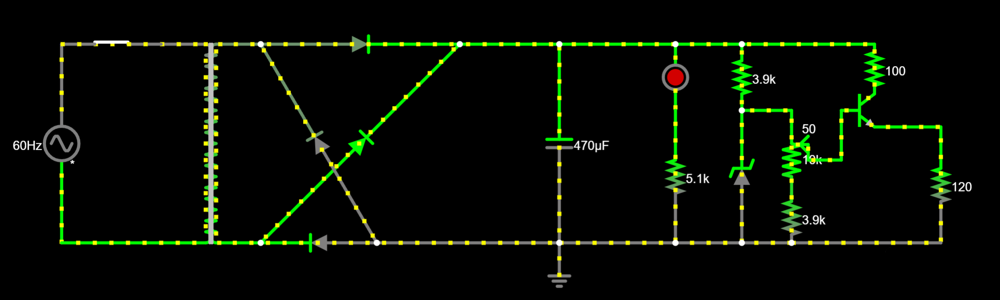
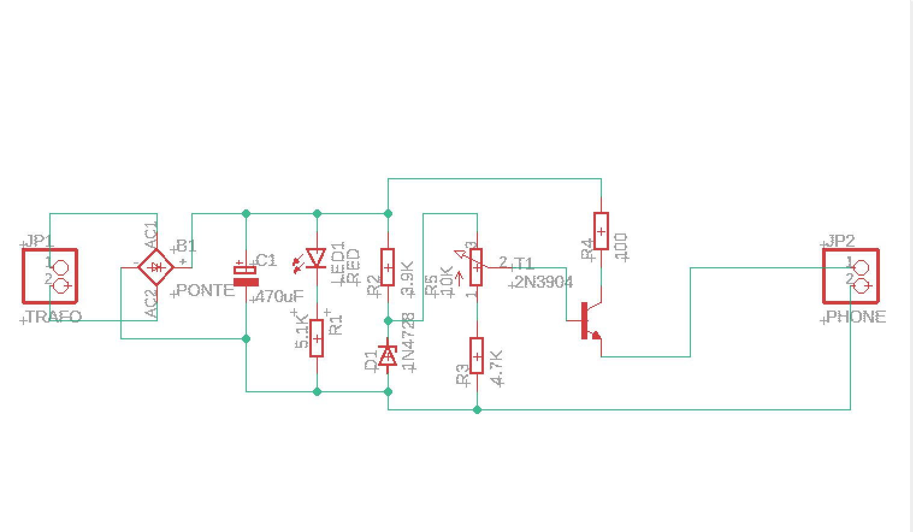
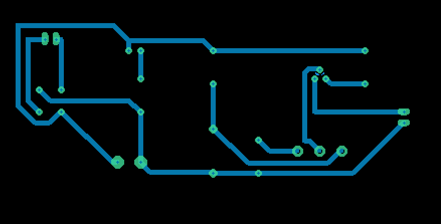
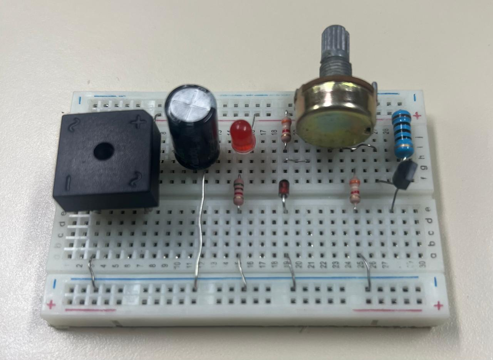

# Trabalho 1 - Fonte de Tensão Ajustável

Projeto realizado para a disciplina SSC0180 – Eletrônica para Computação, ministrada pelo professor Eduardo do Valle Simões. Neste projeto, busca-se projetar uma fonte com tensão ajustável entre 3v e 12v, com uma corrente de 100mA.

# Integrantes - Grupo 53

Kelvin Ribeiro Silva - 16302879

# Diagrama da Fonte

[https://tinyurl.com/2aceomxt](https://tinyurl.com/2agt9gwv)

# Escolha de Componentes

| Quantidade  | Componente  | Especificações | Preço Unitário(R$)|
|-------------|-------------|----------------|--------------
| 1     | Resistor      | 5.1kΩ 5% (1/2W)       | 0,09
| 2     | Resistor      | 3.9kΩ 5% (1/2W)        |0,09
| 2|Transistor NPN|2N2222|0,5
|3|Diodo Zener|1N4743 13V/1W|0,22
|1|Capacitor Eletrolítico|470uF/35V|0,76
|2|Potenciômetro Linear|10K|2,16
|1|Resistor|100Ω 5% (2W)|0,45
|1|LED|Difuso Vermelhor 5mm|0,24
|1|Ponte Retificadora|KBPC1010|6,58
|Total|||14,28

# Projeto do Esquemático e do PCB no EAGLE

# Versão final da fonte na protoboard

